# CourierFlow

CourierFlow is a multi-role courier delivery management web application built with React, Vite, PHP, and MySQL. It covers the full delivery lifecycle: customer booking, order tracking, courier execution, route optimization, admin operations, and payment-aware logistics flows in one product.


## Overview

CourierFlow is organized around three primary roles:

- Customers can create bookings, estimate costs, schedule deliveries, track orders, review invoices, and manage repeat activity from a dashboard.
- Couriers can manage assigned deliveries, follow navigation guidance, confirm delivery actions, track earnings, and work through optimized routes.
- Admins can monitor operations, review analytics, manage users, inspect active deliveries, respond to support activity, and oversee order management.

The repository also includes a PHP backend, a MySQL schema, demo-friendly UI states, and a screenshot library used directly in this README for GitHub presentation.

## Core Features

- Multi-step booking flow with package details, pickup and delivery addresses, scheduling, special instructions, and payment summary
- Public tracking flow with timeline, map, courier details, proof of delivery, and support panel
- Role-gated dashboards for customers, couriers, and admins
- Courier route optimization and navigation views powered by Leaflet
- Earnings, activity, and performance panels for delivery operations
- Admin monitoring for revenue, active deliveries, user management, support tickets, analytics, and order operations
- PHP + MySQL backend structure with routing and assignment algorithms under `backend/Algorithms`


## Tech Stack

- Frontend: React 18, Vite, React Router, Tailwind CSS
- Maps: Leaflet, React Leaflet
- Charts and UI: Recharts, Lucide, Radix Slot
- Backend: PHP
- Database: MySQL
- Payments: Khalti verification hooks

## Screenshots

### Customer Experience

<table>
  <tr>
    <td width="50%">
      <strong>Landing Page</strong><br />
      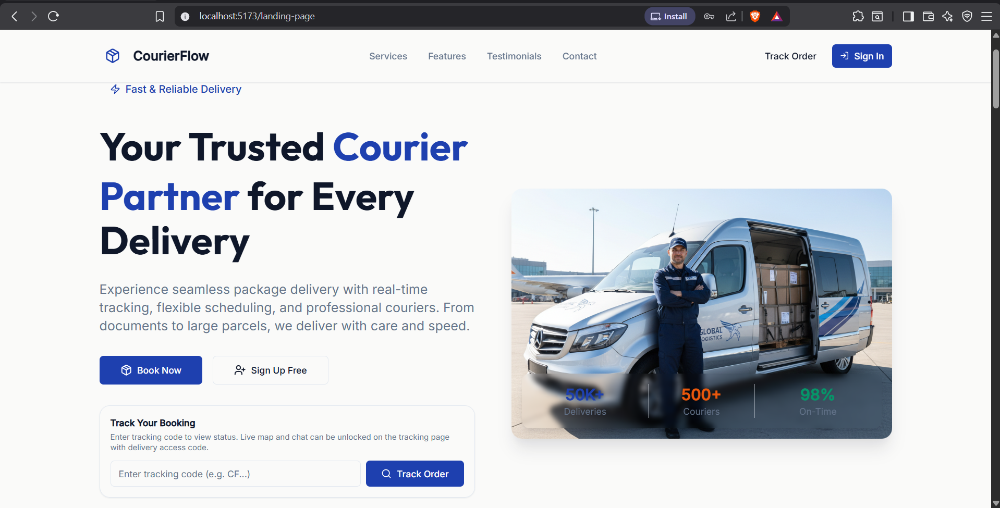
    </td>
    <td width="50%">
      <strong>User Dashboard</strong><br />
      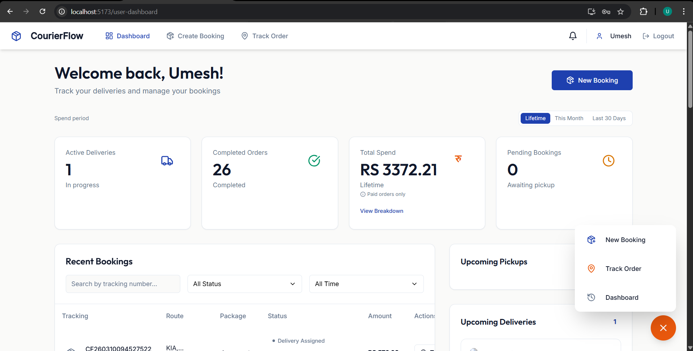
    </td>
  </tr>
  <tr>
    <td width="50%">
      <strong>Create Booking</strong><br />
      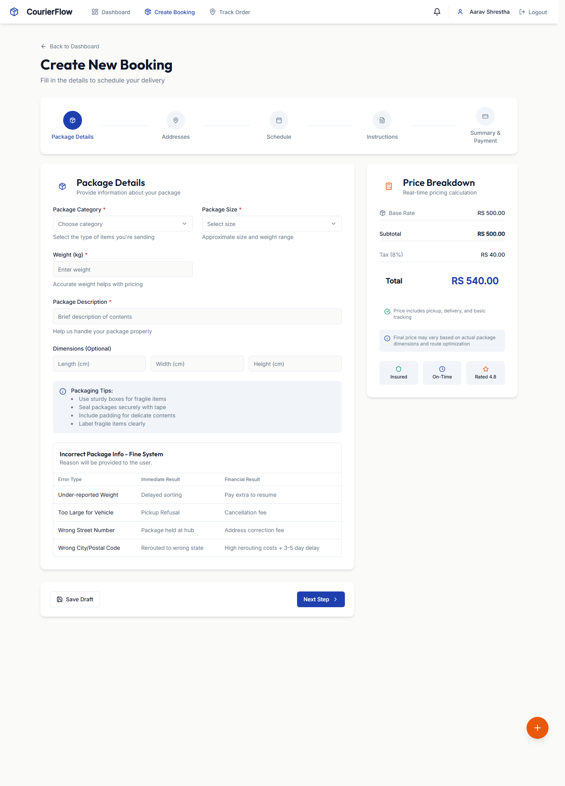
    </td>
    <td width="50%">
      <strong>Order Tracking</strong><br />
      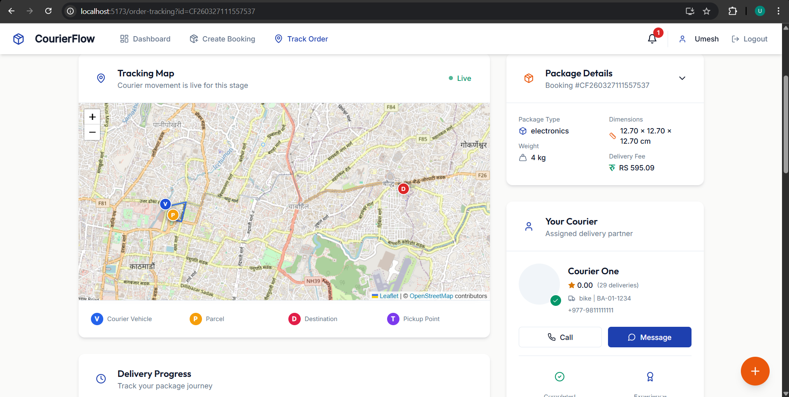
    </td>
  </tr>
</table>

### Courier Operations

<table>
  <tr>
    <td width="50%">
      <strong>Courier Dashboard</strong><br />
      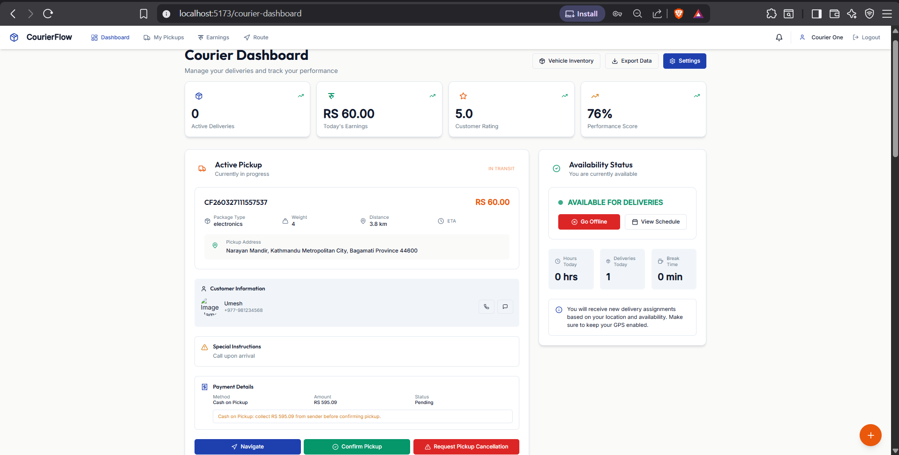
    </td>
    <td width="50%">
      <strong>Route Optimization</strong><br />
      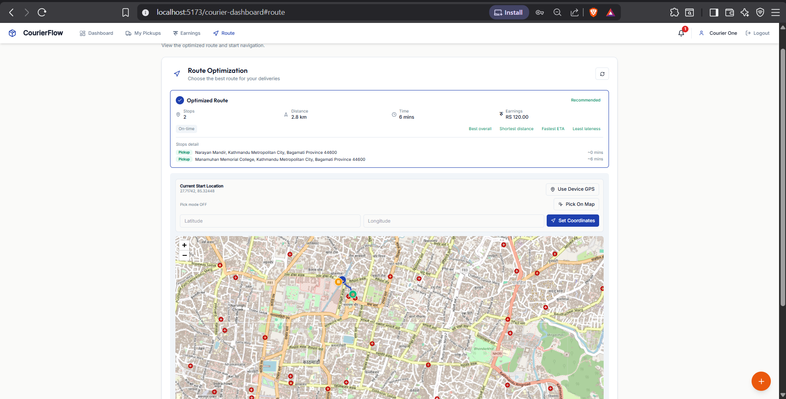
    </td>
  </tr>
  <tr>
    <td width="50%">
      <strong>Navigation</strong><br />
      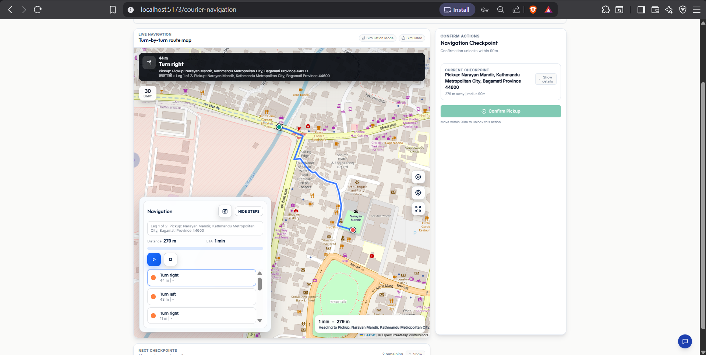
    </td>
    <td width="50%">
      <strong>Confirm Actions</strong><br />
      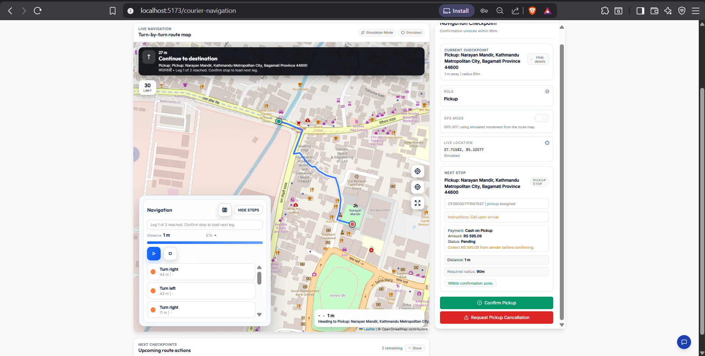
    </td>
  </tr>
</table>

### Admin Operations

<table>
  <tr>
    <td width="50%">
      <strong>Admin Dashboard</strong><br />
      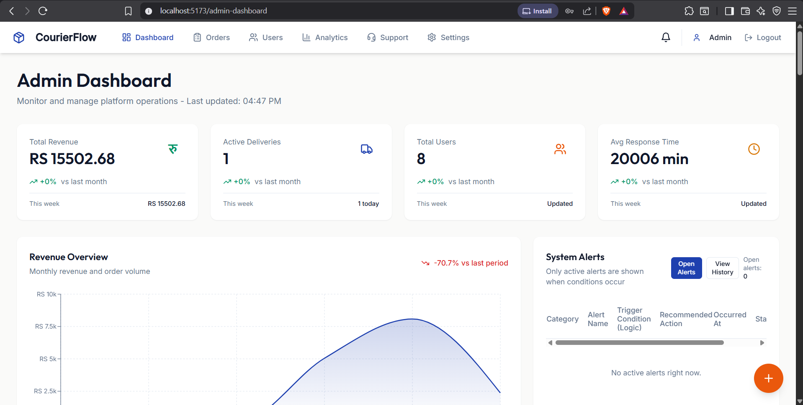
    </td>
    <td width="50%">
      <strong>Analytics</strong><br />
      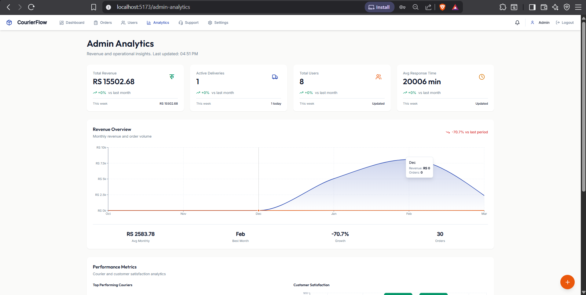
    </td>
  </tr>
  <tr>
    <td width="50%">
      <strong>Order Management</strong><br />
      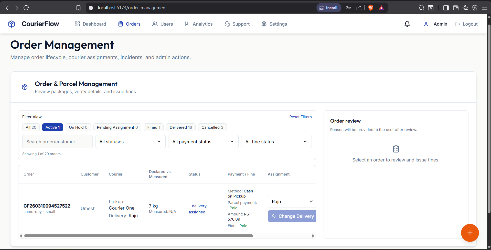
    </td>
    <td width="50%">
      <strong>Support</strong><br />
      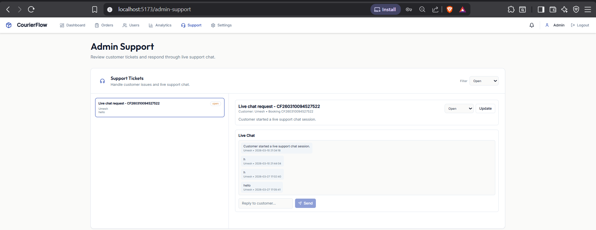
    </td>
  </tr>
</table>

<details>
  <summary><strong>Expanded booking flow screenshots</strong></summary>

  <table>
    <tr>
      <td width="50%">
        <strong>Step 1</strong><br />
        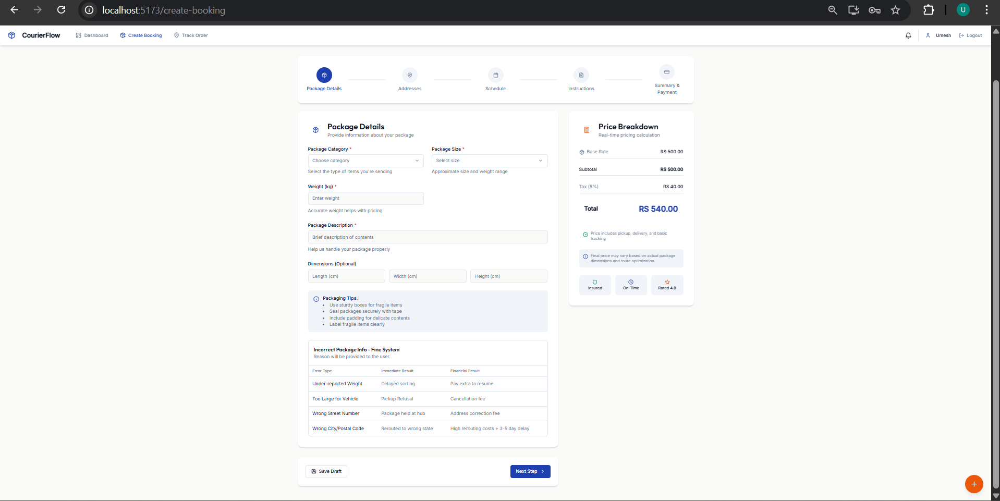
      </td>
      <td width="50%">
        <strong>Step 2</strong><br />
        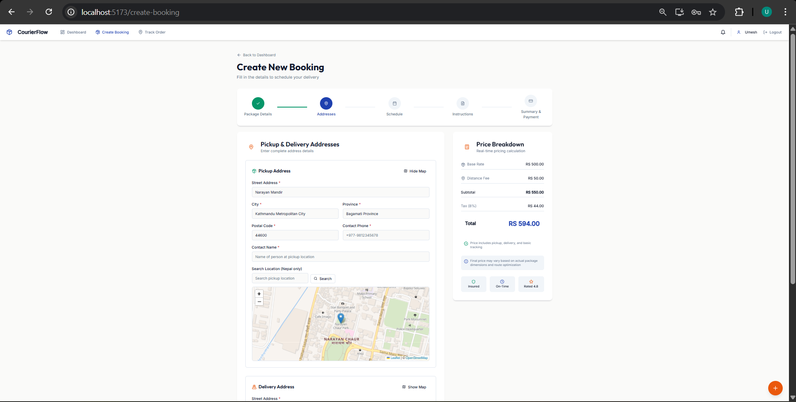
      </td>
    </tr>
    <tr>
      <td width="50%">
        <strong>Step 4</strong><br />
        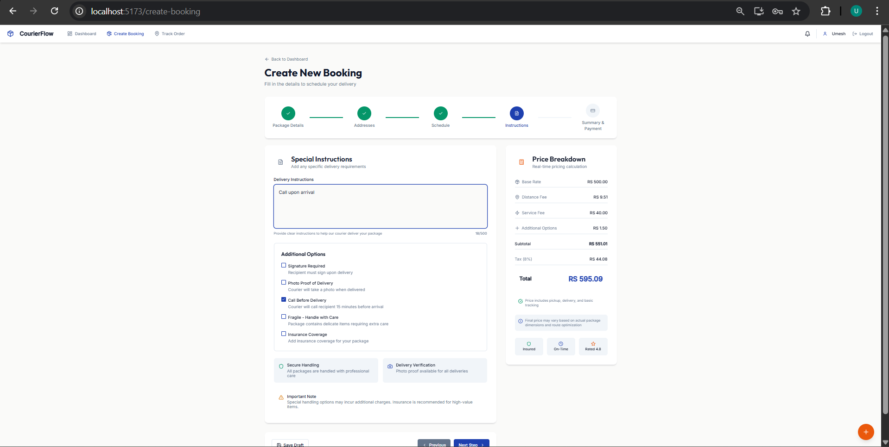
      </td>
      <td width="50%">
        <strong>Step 5</strong><br />
        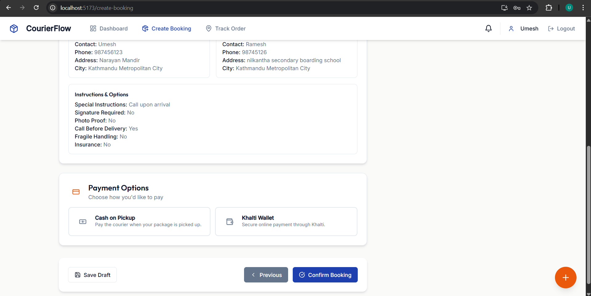
      </td>
    </tr>
    <tr>
      <td width="100%" colspan="2">
        <strong>Completed Booking Summary</strong><br />
        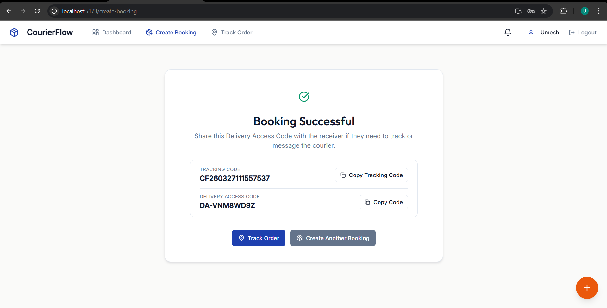
      </td>
    </tr>
  </table>
</details>

## Application Areas

### Customer

- Landing page with service overview, feature sections, testimonials, and order tracking entry
- Authentication, booking creation, checkout, tracking, invoices, profile, and dashboard flows
- Pricing calculation, scheduled delivery support, repeat booking support, and proof-aware delivery options

### Courier

- Assignment dashboard with status-based task handling
- Route planning and navigation flow for pickup, linehaul, and delivery legs
- Earnings tracking, availability management, notifications, and delivery confirmations

### Admin

- Revenue and activity visibility across deliveries and users
- User management, support workflows, operational reporting, and delivery oversight
- Analytics and order management views for dispatch-oriented workflows

## Run Locally

1. Clone the repository and install frontend dependencies.

   ```bash
   git clone https://github.com/Umesh1200/Courier-Delivery-Management-Web-Application-with-Route-optimization.git
   cd Courier-Delivery-Management-Web-Application-with-Route-optimization
   npm install
   ```

2. Create the backend configuration.

   - Copy `backend/config.example.php` to `backend/config.php`
   - Fill in your MySQL credentials and Khalti keys

3. Import the database schema.

   - Import `courier.sql` into MySQL
   - Create or use a database named `courier`

4. Start the backend server.

   ```bash
   php -S 127.0.0.1:8000 -t backend/public
   ```

5. Start the frontend development server.

   ```bash
   npm run dev
   ```

6. Open the app.

   - Frontend: `http://localhost:5173`
   - Backend: `http://localhost:8000`

## Project Structure

- `src/` contains the React application, role-specific pages, shared UI, and utilities
- `backend/public/` contains the PHP entry point and public backend endpoints
- `backend/Algorithms/` contains route optimization and auto-assignment logic
- `courier.sql` contains the base schema used by the backend
- `screenshots/` stores the GitHub README image assets
- `mapnav/` contains map and navigation support assets

## Notes

- `backend/config.php` is intentionally excluded from version control
- The frontend expects the backend at `http://localhost:8000` unless  change in the API configuration
